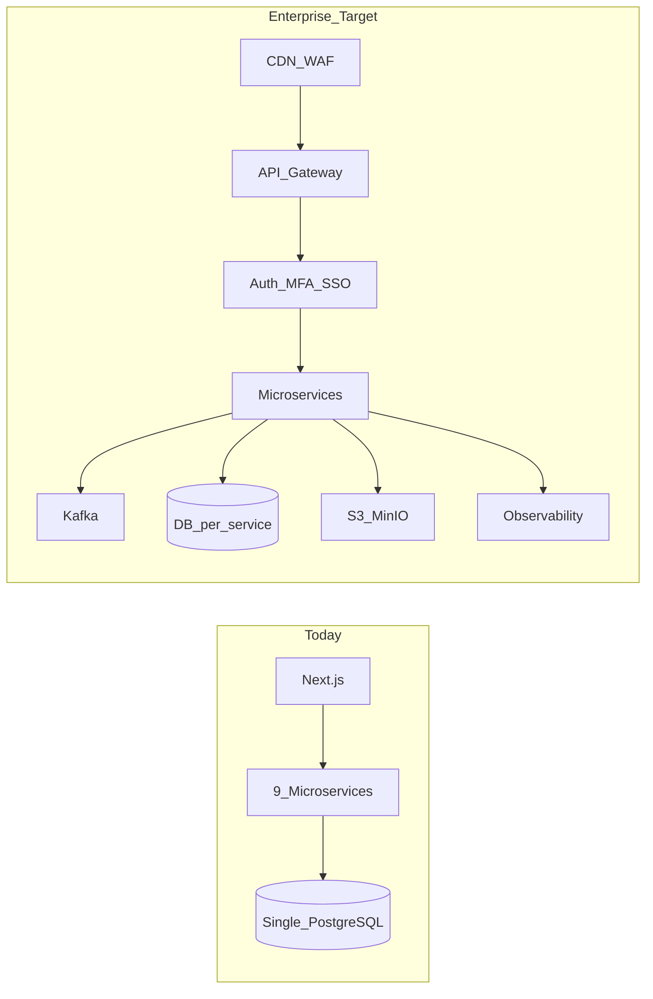
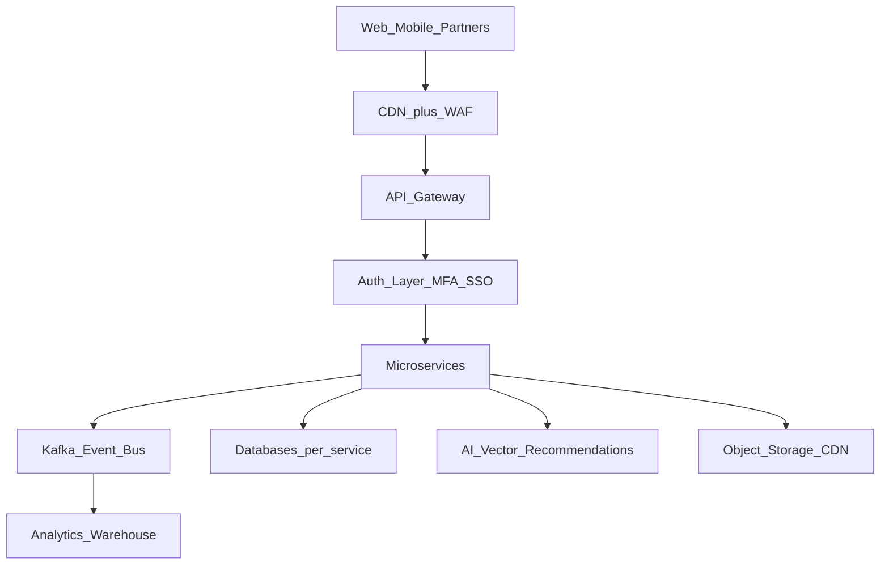

# LERA LMS — Current Implementation Audit & Missing System Analysis

**Purpose:** Enterprise readiness assessment — what LERA already implements vs. what is missing for a global, AI-native education platform (EduOS).  
**Last updated:** May 2026. Complements [LERA_PLATFORM_OVERVIEW.md](LERA_PLATFORM_OVERVIEW.md) (features and workflows).

---

## 1. Executive summary

LERA already contains the foundation of a large-scale **Learning Management System (LMS)**. Current status is **not** a basic school application. It is evolving into:

| Pillar | Role in LERA |
|--------|----------------|
| **LMS** | Learning Management System |
| **CRM** | Lead & enrollment |
| **HRM** | Human resource management |
| **ERP-like** | Education operations platform |
| **Comms** | Real-time communication (Connect) |
| **Finance** | Fees, invoicing, payroll |

**Overall posture:** *Production-shaped but not yet enterprise-hardened.*

| Strength | Gap |
|----------|-----|
| Strong architecture direction | Scalability layers incomplete |
| Core business modules exist | AI learning engine early-stage |
| Many enterprise foundations | Mobile, analytics, ops layers partial |
| Nine microservices + unified UI | Shared DB risk at scale |

**Strategic transition:**

```text
English Centre Software  →  Enterprise LMS  →  Global EduOS Platform
```

Focus next on **infrastructure hardening**, **AI learning engine**, **scalability**, **analytics**, and **native mobile** — not random feature sprawl.

---

## 2. Current LMS implementation status

### A. Frontend system

**Status: Strong**

| Area | Stack / notes |
|------|----------------|
| Framework | Next.js 14, React, TailwindCSS |
| Mobile | Capacitor scaffold (`com.lera.app`) — see [mobile-shipability](../.cursor/rules/mobile-shipability.mdc) |
| Access | Role-based dashboards, permission-gated nav ([`layout.tsx`](../frontend/app/dashboard/layout.tsx)) |
| i18n | EN / VI ([`LanguageContext`](../frontend/app/context/LanguageContext.tsx)) |

**Implemented (representative):**

- **Public:** home, courses, blog, trial booking, placement quiz, SEO/legal, center locator
- **Dashboards:** Chairman, CEO, Director, teacher, student, parent, HR/admin variants
- **CRM:** leads, follow-up, conversion, campaigns ([`/dashboard/crm`](../frontend/app/dashboard/crm))
- **Academy:** courses, classes, students, assignments, exams, certificates, attendance
- **Finance:** fee plans, discounts, receipts; payroll / salary components
- **Connect:** real-time chat, notifications, voice/video foundation, STOMP WebSocket, “Live” indicator

### B. Backend system

**Status: Very strong foundation**

| Service | Port | Assessment |
|---------|------|------------|
| identity_service | 8081 | Good — auth, users, tenants, audit |
| academy_service | 8082 | Good — LMS core, CMS, library, sports |
| payment_service | 8083 | Good |
| payroll_service | 8084 | Good |
| attendance_service | 8085 | Good |
| connect_service | 8086 | **Strong** — CRM, chat, push, WebSocket |
| ai_gateway | 8087 | **Early-stage** |
| rule_engine | 8088 | Good concept |
| social_media_service | 8089 | Optional |

See [LERA_PLATFORM_OVERVIEW.md § Backend services](LERA_PLATFORM_OVERVIEW.md#backend-services-map).

### C. Database

**Status: Medium risk at scale**

| Current | Problem |
|---------|---------|
| Shared PostgreSQL `lera`, 107+ tables | All services read/write one DB — coupling and blast radius |
| `ddl-auto=update` in dev | Flyway on all nine services with **per-service history tables** (`flyway_*_history`) on shared `lera`; DB coupling remains |

**Missing for enterprise scale:**

- Per-service database separation
- Sharding / read replicas
- Analytics warehouse (OLAP)
- Data partitioning strategy

### D. Security

**Status: Good start, not zero-trust**

**Implemented:**

- JWT + HttpOnly cookies + refresh for browser sessions ([`api.ts`](../frontend/lib/api.ts)); **`Authorization: Bearer` JWT** for Capacitor/mobile WebView and other non-cookie clients — same identity surface as cookies, so enterprise MFA/SSO and session policy must eventually cover both paths.
- Permission-gated UI ([`PermissionContext`](../frontend/app/context/PermissionContext.tsx))
- WebSocket auth; chat/call participant authorization (connect_service)
- Audit concepts; recent IDOR hardening (center management, Connect)
- **API error leakage (mitigated, May 2026):** `GlobalExceptionHandler` in all nine Spring services returns a generic message for unhandled 500s (full exception logged server-side only). Access denied / authentication responses use fixed client copy. Controllers that returned raw `IOException` / `IllegalStateException` text for non-domain errors were tightened (e.g. upload, salary config).

**Missing:**

- MFA, SSO (SAML/OIDC)
- Device/session management
- SIEM-grade centralized security logging
- Full policy engine (beyond role + permission flags)
- Hard tenant isolation (row-level + network)

Archive: [NEW_LOOPHOLES_GAPS_ANALYSIS.md](archive/2026-05/NEW_LOOPHOLES_GAPS_ANALYSIS.md) — 18/22 items fixed (Flyway on all services, May 2026).

### E. LMS core features

| Module | Status |
|--------|--------|
| Student / teacher management | Implemented |
| Attendance & leave | Implemented |
| Assignments & exams | Implemented |
| Certificates & gamification (partial) | Implemented |
| Timetable / calendar | Implemented |
| Enrollment | Implemented |
| Parent / student dashboards | Implemented |
| Notifications & push scaffold | Implemented |

---

## 3. Major missing LMS features

### A. True learning engine

LERA manages **operations** well; it does **not** yet have a deeply intelligent **learning engine**.

| Capability | Gap |
|------------|-----|
| **Adaptive learning** | Weak-area detection, difficulty adjustment, auto lesson recommendations, personalized study plans |
| **AI learning assistant** | Speaking feedback, grammar, pronunciation scoring, vocabulary coaching, writing analysis |
| **Learning paths** | IELTS / TOEIC / Cambridge roadmaps, skill trees, level mastery |

**Existing hook:** [`ai_gateway`](../backend/ai_gateway) (8087) — conversations, assessments, learning paths APIs; needs product depth + orchestration.

### B. Video learning platform

| Missing |
|---------|
| Recorded class library, streaming, CDN |
| Playback progress, in-video quizzes, subtitles |
| Video analytics |

### C. Homework intelligence

| Missing |
|---------|
| AI auto-grading, OCR for written work |
| Speaking / writing evaluation pipelines |
| Plagiarism detection |

### D. Mobile experience

| Current | Missing |
|---------|---------|
| Capacitor WebView + push registration | Native store apps, offline learning, mobile-first UX, App Store / Play release |

### E. Enterprise analytics

**Academic:** learning trends, dropout prediction, weakness heatmaps, teacher effectiveness, student performance AI.

**Business:** revenue prediction, conversion AI, churn, franchise benchmarking.

**Current:** operational dashboards; no dedicated warehouse or ML layer.

### F. AI platform (infrastructure)

| Missing beyond early ai_gateway |
|----------------------------------|
| Orchestration, vector DB, long-term AI memory |
| Recommendation engine, batch pipelines |
| LLM routing, cost/quality observability |

### G. Real online classroom

| Missing |
|---------|
| Whiteboard, breakout rooms, live polls |
| In-class attendance, shared notes, moderation |
| Live quizzes, optimized screen share |

Connect has meetings/calls foundation; not a full virtual classroom.

### H. Gamification (depth)

**Partial today:** points, certificates ([`/dashboard/superadmin/gamification`](../frontend/app/dashboard/superadmin/gamification)).

**Missing:** XP, levels, streaks, challenges, achievements, leaderboards, team competitions.

### I. Multi-tenant hardening

**Concepts exist** (tenants, centers); **missing:** strict isolation, regional settings, multi-currency, country tax, franchise billing, per-tenant analytics.

### J. DevOps & scaling

| Current | Missing |
|---------|---------|
| Docker, local scripts, NGINX gateway | Kubernetes, HPA, canary, multi-region |
| Per-service health | Central logging, distributed tracing, DR runbooks |

---

## 4. Most critical architecture gaps



| Priority | Gap | Why it matters |
|----------|-----|----------------|
| **P1** | Database separation | Scale, blast radius, team autonomy |
| **P2** | Event architecture (Kafka) | Async workflows, decoupling, analytics ingest |
| **P3** | Observability (Prometheus, Grafana, Loki, OTel) | Production debugging and SLOs |
| **P4** | Enterprise IAM (e.g. Keycloak, MFA, SSO) | Franchise and enterprise sales |
| **P5** | Object storage (S3/MinIO) | **Partial (May 2026):** academy uploads via `FileStorage` — local default, `lera.storage.backend=s3`; CDN/video pipeline still outstanding |

---

## 5. What to add next (phased roadmap)

### Phase 1 — Harden the foundation (do first)

| Track | Items |
|-------|--------|
| **Infrastructure** | Kafka, Redis cluster, hardened API gateway, object storage, monitoring stack |
| **Security** | MFA, SSO, expanded RBAC/audit |
| **Database** | DB separation strategy (even if phased); consider `ddl-auto=validate` in dev after migrations stabilize |

### Phase 2 — Real LMS intelligence

| Items |
|-------|
| AI tutor (productized on ai_gateway) |
| Learning path engine |
| Adaptive learning + recommendations |
| AI speaking / homework grading |
| Student analytics |

### Phase 3 — Enterprise education platform

| Items |
|-------|
| Franchise management |
| Regional infrastructure |
| AI analytics warehouse |
| Native mobile apps |
| White-label SaaS |

---

## 6. Recommended future architecture (target)



---

## 7. Final assessment

### Current level

LERA is an **advanced startup / early enterprise platform**. It already exceeds typical:

- Basic LMS products
- Small school admin software
- Simple CRM-only tools

### What it can become

With scaling + AI architecture:

**Enterprise Education Operating System (EduOS)** — capable of 1M+ students, 100k+ staff, global franchise, AI-native delivery, SaaS licensing, multi-country ops.

### Most important next step

Do **not** add random features. Execute in order:

1. Infrastructure hardening  
2. AI learning engine (on existing ai_gateway)  
3. Scalability architecture  
4. Analytics platform  
5. Native mobile ecosystem  
6. Enterprise operations (IAM, tenant isolation, observability)

---

## Related documentation

| Document | Focus |
|----------|--------|
| [LERA_PLATFORM_OVERVIEW.md](LERA_PLATFORM_OVERVIEW.md) | Live feature map, workflows, ports |
| [english-centre-execution.md](english-centre-execution.md) | Trial/placement vertical slice |
| [connect-academy-env.md](connect-academy-env.md) | CRM → academy placement sync |
| [archive/2026-05/FULL_GAP_ANALYSIS_10M_SCALE.md](archive/2026-05/FULL_GAP_ANALYSIS_10M_SCALE.md) | Historical scale gap analysis |
| [archive/2026-05/NEW_LOOPHOLES_GAPS_ANALYSIS.md](archive/2026-05/NEW_LOOPHOLES_GAPS_ANALYSIS.md) | Security loophole tracker |
