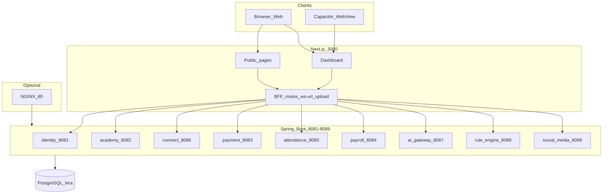
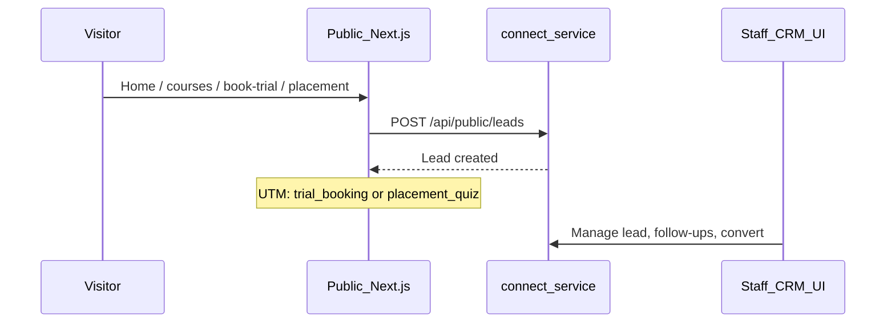
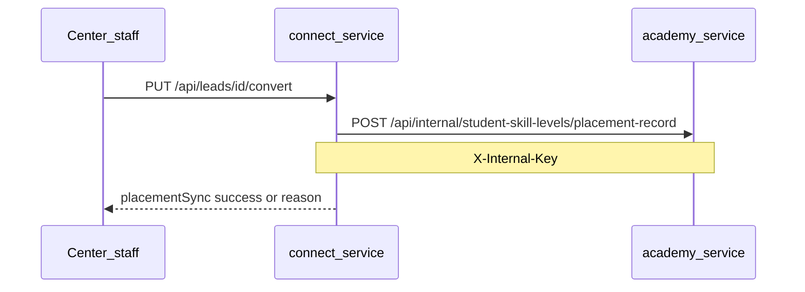

# LERA Group — Website Status, Workflows & Features

**Canonical platform map** for the LERA monorepo: current status, user/data workflows, and feature surface by area.  
**Last updated:** May 2026. Supersedes scattered status notes in `docs/archive/2026-05/LERA_PLATFORM_STATUS.md` for day-to-day reference.

For **enterprise readiness, missing LMS/AI/infra layers, and phased roadmap**, see [LERA_LMS_GAP_ANALYSIS.md](LERA_LMS_GAP_ANALYSIS.md).

---

## Current status (high level)

LERA is a **production-shaped monorepo** (v192-final): one **Next.js 14** frontend (~310 pages) talking to **nine Spring Boot microservices** over a shared **PostgreSQL** database (`lera`, 107+ tables). It targets **multi-tenant education centers** (English centres, sports academies) with CRM, LMS, finance, HR, and communications.

| Area | Status |
|------|--------|
| **Public marketing site** | Implemented — CMS-driven pages, trial booking, placement quiz |
| **Role-based dashboards** | Implemented — Chairman through Guest; permission-gated sidebar |
| **Backend APIs** | Broad coverage — ~200+ controller domains across 9 services |
| **Auth** | HttpOnly JWT cookies + Bearer legacy; refresh on 401; impersonation (audited) |
| **LERA Connect (chat/CRM)** | Implemented — REST + STOMP WebSocket; recent **authorization hardening** and live messaging |
| **Mobile path** | Scaffolded — Capacitor (`com.lera.app`), push (APNs/FCM), not App Store shipped yet |
| **English-centre vertical** | Active slice — trial + placement funnel → CRM → academy placement sync |
| **Infra gaps (documented)** | Flyway enabled on **all nine** Spring services (dev + prod, `baseline-on-migrate`); shared PostgreSQL `lera` remains; per-service DB split not started; transactional email optional |

**Recent work:** Center-management IDOR fixes; Connect chat/call/WebSocket security; STOMP live messages with “Live” indicator; server-side WS token refresh ([`frontend/app/api/chat/ws-url/route.ts`](../frontend/app/api/chat/ws-url/route.ts), [`frontend/lib/server-auth-token.ts`](../frontend/lib/server-auth-token.ts)); **call lifecycle via push** — backend broadcasts `call_ended` (and related) data on FCM/APNs/Web Push; the dashboard Connect page and [`frontend/public/sw.js`](../frontend/public/sw.js) deep-link with `incomingCall` / `callEnded` query params plus in-app events ([`frontend/lib/incoming-call-push.ts`](../frontend/lib/incoming-call-push.ts)) so tabs without an active STOMP socket still hang up cleanly. **Generic HTTP 500 bodies** are sanitized across all nine Spring services (`GlobalExceptionHandler`). **STOMP typing indicators** on Connect ([`use-connect-stomp.ts`](../frontend/lib/use-connect-stomp.ts), [`connect/page.tsx`](../frontend/app/dashboard/connect/page.tsx)).

---

## System architecture

**Routing:** [`frontend/next.config.js`](../frontend/next.config.js) rewrites `/api/*` to the correct service port locally; Docker uses [`gateway/nginx/nginx.conf`](../gateway/nginx/nginx.conf).

**Start locally:** [`start-lera.sh`](../start-lera.sh) or [`LOCAL_STARTUP_README.md`](../LOCAL_STARTUP_README.md) — core ports **8081–8086** + frontend **3000**; optional **8087–8089** with flags.

---

## User workflows

### 1. Visitor → lead (public funnel)

- **Touchpoints:** [`frontend/lib/english-centre-vertical-scope.ts`](../frontend/lib/english-centre-vertical-scope.ts) — `/`, `/courses`, `/book-trial`, `/placement` → CRM at `/dashboard/crm/leads`.
- **Staff:** Assign, follow up, convert lead; optional link to academy student.

### 2. Lead convert → placement in academy

- Documented in [english-centre-execution.md](english-centre-execution.md) and [connect-academy-env.md](connect-academy-env.md).

### 3. Login → role dashboard

1. **`/auth/login`** — identity sets HttpOnly `token` + `refreshToken`; frontend sets `tokenSet` hint.
2. **`/dashboard`** — redirects by `actualRole` cookie ([`frontend/app/dashboard/page.tsx`](../frontend/app/dashboard/page.tsx)).
3. **Sidebar** — built in [`frontend/app/dashboard/layout.tsx`](../frontend/app/dashboard/layout.tsx); items filtered by [`PermissionContext`](../frontend/app/context/PermissionContext.tsx).
4. **API calls** — [`frontend/lib/api.ts`](../frontend/lib/api.ts): `credentials: include`, optional Bearer, auto-refresh on 401.

### 4. LERA Connect (real-time chat)

1. User opens **`/dashboard/connect`**.
2. Client fetches **`GET /api/chat/ws-url`** (server reads/refreshes JWT).
3. **STOMP** subscribes to `/topic/chat/{conversationId}` ([`frontend/lib/use-connect-stomp.ts`](../frontend/lib/use-connect-stomp.ts)).
4. Optionally subscribes to **`/topic/typing/{conversationId}`** and publishes **`/app/typing/{conversationId}`** for live typing indicators (same hook).
5. Send via **REST** `POST /api/chat/messages` → backend saves → [`ChatRealtimePublisher`](../backend/connect_service/src/main/java/com/lera/connect_service/service/ChatRealtimePublisher.java) broadcasts.
6. Polling fallback: **2s** if WS down, **15s** if connected; header shows **Live** when STOMP is up.

**Security (current):** Participant-only chat/calls; JWT on WebSocket; no global message listing ([`ChatAuthorizationService`](../backend/connect_service/src/main/java/com/lera/connect_service/security/ChatAuthorizationService.java), [`StompChannelSecurityInterceptor`](../backend/connect_service/src/main/java/com/lera/connect_service/security/StompChannelSecurityInterceptor.java)).

### 5. Notifications & push

- In-app: `connect_service` `/api/notifications`.
- Cross-service: academy/payment/attendance → `NotificationClient` → connect.
- Mobile: [`frontend/lib/native-push.ts`](../frontend/lib/native-push.ts) → `POST /api/device-tokens`; APNs/FCM when env configured.

### 6. Parent / student mobile slice

- **`GET /api/students/self`** — maps login user to academy student row.
- Student/parent dashboards: classes, assignments, attendance, payments (see [english-centre-execution.md](english-centre-execution.md)).

---

## Public website features

| Route | Purpose |
|-------|---------|
| `/` | Home, trial capture, CMS sections |
| `/about`, `/contact`, `/faq`, `/privacy`, `/terms` | Marketing & legal |
| `/courses`, `/courses/[slug]` | Course catalogue |
| `/centers` | Centre locator |
| `/blog`, `/blog/[slug]` | Blog (sanitized HTML) |
| `/book-trial` | Trial lesson booking → CRM lead |
| `/placement` | Placement quiz → CRM lead |
| `/auth/*` | Login, register, forgot/reset password |
| `/admin/website-settings` | Legacy CMS shortcut |

**CMS editing:** Superadmin **Public Website** menu and Chairman **Website Content** mirror — hero, courses, blog, SEO, branding, etc. under `/dashboard/superadmin/public-website/*` and `/dashboard/chairman/website-content/*`.

**Languages:** EN / VI via [`LanguageContext`](../frontend/app/context/LanguageContext.tsx).

---

## Dashboard features (by domain)

Navigation is permission-based; below is the **full product surface** (not every role sees all items).

### Organization & platform

- **Chairman:** org control — users, staff, board, directors, org structure, roles, centers, departments, courses, marketing, website CMS, custom fields, approvals, audit.
- **CEO / Director:** executive overview, centers, analytics, finance/strategy or staff/reports.
- **Superadmin:** largest surface — tenants, feature flags, health monitor, data import, audit logs, user-role mapping, all center ops.

### Academy (LMS)

- Students, teachers, courses, classes, classrooms, enrollments.
- Curriculum: modules, lessons, materials, lesson plans.
- Assignments, exams, grades, certificates, gamification, student points.
- Library, bookstore, transport, hostel, sports (teams, matches, facilities).
- Reports, import, form configs, permission slips.

### Attendance & leave

- Student/teacher attendance, overview dashboards, leave requests & approvals ([`frontend/app/dashboard/attendance`](../frontend/app/dashboard/attendance)).

### CRM (LERA Connect)

- Leads, follow-ups, deals, tags, automations, campaigns, referrals, lead statuses, communications, analytics ([`frontend/app/dashboard/crm`](../frontend/app/dashboard/crm)).
- **Connect UI:** 1:1 and group chat, stories, voice/video calls (permission modal), reactions, file attachments, real-time typing (STOMP).

### Finance & payroll

- **Finance:** fee plans, rules, discounts, scholarships, invoices, payments, receipts, ledger, late fees, refunds ([`frontend/app/dashboard/finance`](../frontend/app/dashboard/finance)).
- **Payroll:** cycles, salary components, tax, payouts, bonuses, deductions, teacher overtime (superadmin + `/dashboard/payroll`).

### Communications & AI

- Notifications (bell in dashboard layout).
- **AI Gateway:** tutor, assessments, learning paths, recommendations, workbench (superadmin `/dashboard/superadmin/ai*`).
- **Social media service (optional):** posts, ad accounts, campaigns, analytics — port **8089**, not always started locally.

### Operations

- Calendar, timetable, activities, messages, settings, help.
- Chat admin: polls, moderation, class groups, meetings (superadmin).
- Rule engine: business rules CRUD (`/api/rules`).

### Role-specific home areas

| Role | Primary home |
|------|----------------|
| Chairman | `/dashboard/chairman` |
| CEO | `/dashboard/ceo` |
| Director | `/dashboard/director` |
| Super Admin | `/dashboard/superadmin` |
| Center Manager | `/dashboard/centermanager` |
| Center Admin | `/dashboard/center-admin` + shared `/dashboard/academy` |
| Academic Manager | `/dashboard/academicmanager` |
| Teacher | `/dashboard/teacher` |
| TA | `/dashboard/ta` |
| Staff | `/dashboard/staff` |
| Student | `/dashboard/student` |
| Parent | `/dashboard/parent` |
| Guest / pending | `/dashboard/guest` |

---

## Backend services map

| Port | Service | Main API domains |
|------|---------|------------------|
| 8081 | identity | Auth, users, roles, tenants, centers, staff, audit, health aggregator |
| 8082 | academy | Students, classes, courses, CMS, library, transport, sports, exams |
| 8083 | payment | Invoices, fees, scholarships, ledger, finance dashboard |
| 8084 | payroll | Payroll cycles, salary, tax, overtime |
| 8085 | attendance | Attendance, leave, teacher sessions |
| 8086 | connect | CRM/leads, chat, notifications, calls, WebSocket STOMP, push tokens |
| 8087 | ai_gateway | AI chat, assessments, learning paths |
| 8088 | rule_engine | Dynamic rules |
| 8089 | social_media | Social posts, ad campaigns (optional) |

**Auth model:** JWT from identity; validated per service; `X-Internal-Key` for service-to-service (`/api/internal/**`, notification triggers).

---

## Documented backlog / not complete

From [english-centre-execution.md](english-centre-execution.md) and archive gap docs:

- **WebRTC signaling** for Connect voice/video (calls exist; full peer signaling may be incomplete).
- **Transactional email** breadth (password reset works when SMTP configured).
- **Reporting pack** (retention, utilization dashboards).
- **Social media** scheduling at production depth (service exists; optional).
- **Flyway migrations** — enabled on all nine services; shared DB split still outstanding.
- **Generic HTTP 500 payloads** — mitigated (see `@RestControllerAdvice` in all nine services; full exceptions logged server-side only). Residual risk: intentional `IllegalArgumentException` messages on 400 remain user-facing by design.
- **Capacitor App Store / Play** — scaffold only; WebView + push wired, store release not done.

Archived status: [NEW_LOOPHOLES_GAPS_ANALYSIS.md](archive/2026-05/NEW_LOOPHOLES_GAPS_ANALYSIS.md) reports **17/22** security items fixed or mitigated; email service and Flyway marked pending.

---

## How to verify current status yourself

1. **DB:** `./setup-local-postgres.sh` or Docker Postgres (`lera` / `lera123`).
2. **Stack:** `./start-lera.sh` → open `http://localhost:3000`.
3. **Health:** `http://localhost:8081/api/health` (aggregates all services).
4. **Smoke:** `frontend/e2e/smoke.spec.ts` (Playwright).
5. **Connect live chat:** two browsers on `/dashboard/connect`, watch **Live** badge, near-instant messages, and **typing** indicators when both sides use STOMP.

---

This document is descriptive only (no behavioral requirements). For enterprise gaps and roadmap, see [LERA_LMS_GAP_ANALYSIS.md](LERA_LMS_GAP_ANALYSIS.md).

## Related documentation

| Topic | Path |
|-------|------|
| LMS gap analysis & enterprise roadmap | [LERA_LMS_GAP_ANALYSIS.md](LERA_LMS_GAP_ANALYSIS.md) |
| Monorepo overview | [README.md](../README.md) |
| Local startup | [LOCAL_STARTUP_README.md](../LOCAL_STARTUP_README.md) |
| English-centre scope | [english-centre-execution.md](english-centre-execution.md) |
| Connect env / placement | [connect-academy-env.md](connect-academy-env.md) |
| Placement ops runbook | [ops/connect-academy-placement.md](ops/connect-academy-placement.md) |
| Mobile shipability rules | [.cursor/rules/mobile-shipability.mdc](../.cursor/rules/mobile-shipability.mdc) |
| Dashboard nav (feature list) | [frontend/app/dashboard/layout.tsx](../frontend/app/dashboard/layout.tsx) |
| API rewrites | [frontend/next.config.js](../frontend/next.config.js) |
